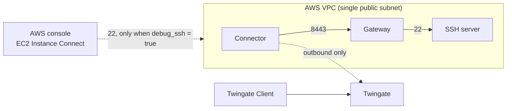

# AWS Gateway + SSH Resource (Self-Signed Certificates)

This example deploys a Twingate Gateway, Connector, and SSH server on AWS using
self-signed certificates.

> **Warning:** This example generates private keys and certificates that are stored
> unencrypted in the Terraform state. Use a
> [remote backend with encryption](https://developer.hashicorp.com/terraform/language/settings/backends/configuration)
> to protect sensitive state data in production.

## Prerequisites

- Terraform >= 1.4
- A Twingate account with an [API token](https://docs.twingate.com/docs/api-overview)
- An AWS account with credentials configured (`aws configure` or environment variables)

## Usage

```bash
cp terraform.tfvars.example terraform.tfvars
```

Fill out the `terraform.tfvars` file.

```bash
terraform init
terraform apply
```

See `variables.tf` for the full list of inputs.

## Architecture



Each instance has a public IP to enable easier debugging, and the security group
only allows traffic between the instances. For production, use a private subnet
with a NAT gateway, since no component needs inbound access from the internet.

## Resource alias

Users connect to the SSH server by its private IP or, if `resource_alias` is set,
by the alias. Both are shown on the Resource in the Twingate Client.

```bash
ssh <private-ip>
```

To use a hostname, set `resource_alias`:

```hcl
resource_alias = "ssh-server.int"
```

Users can then connect with:

```bash
ssh ssh-server.int
```

## Troubleshooting

To open a shell from the AWS console, set `debug_ssh` in `terraform.tfvars`. This
allows port 22 from AWS's EC2 Instance Connect IP range only:

```hcl
debug_ssh = true
```

```bash
terraform apply
```

In the AWS console, open **EC2 > Instances > demo-gateway > Connect > EC2 Instance
Connect**, choose **EC2 Instance Connect**, and log in as `ubuntu`. No SSH key
pair is required, but the IAM identity you connect with needs the
`ec2-instance-connect:SendSSHPublicKey` permission.

On the Gateway, view the logs:

```bash
sudo journalctl -u gateway -f -o cat | jq -rR 'fromjson? // empty'
```

When you're done, set `debug_ssh = false` (or remove the line) and run
`terraform apply` again to close port 22.

## Clean up

```bash
terraform destroy
```
